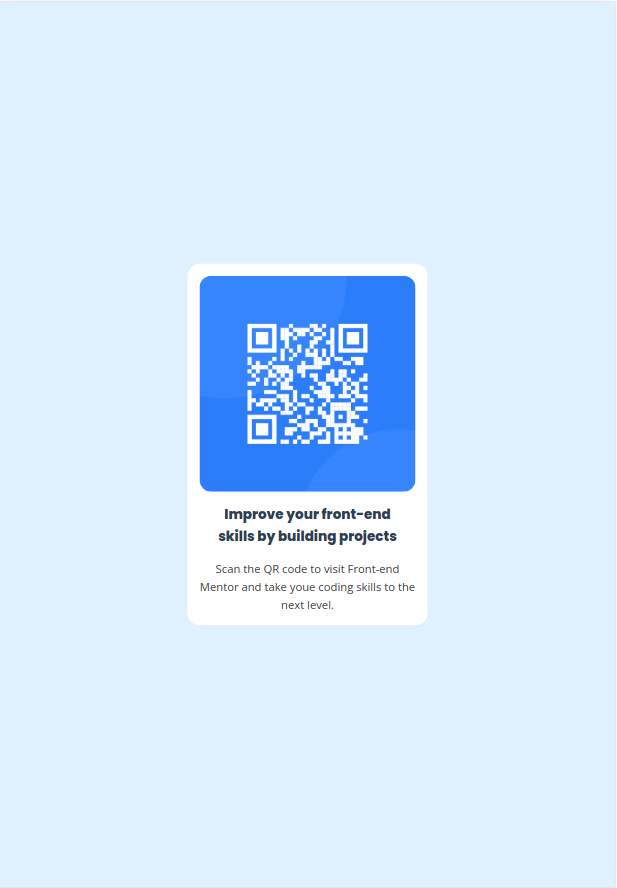
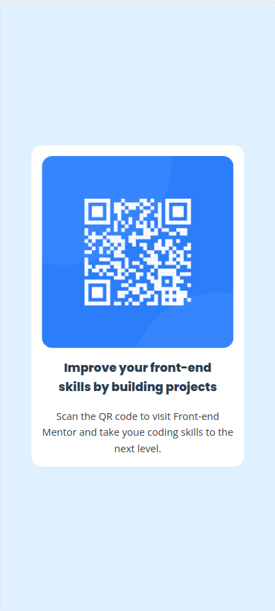

# Frontend Mentor - QR code component solution

This is a solution to the [QR code component challenge on Frontend Mentor](https://www.frontendmentor.io/challenges/qr-code-component-iux_sIO_H). Frontend Mentor challenges help you improve your coding skills by building realistic projects. 

## Table of contents

- [Overview](#overview)
  - [Screenshot](#screenshot)
  - [Links](#links)
- [My process](#my-process)
  - [Built with](#built-with)
  - [What I learned](#what-i-learned)
  - [Continued development](#continued-development)
  - [Useful resources](#useful-resources)
- [Author](#author)
- [Acknowledgments](#acknowledgments)

**Note: Delete this note and update the table of contents based on what sections you keep.**

## Overview

### Screenshot

#### Desktop


#### Tablet



#### Mobile


### Links

- [Solution URL](https://github.com/anabscruz/qrcode-challange-vue)
- [Live Site URL](https://anabscruz.github.io/qrcode-challange-vue/)

## My process

### Built with

- Flexbox
- [Vue](https://vuejs.org/) - JS library


### What I learned

This is my first project with Vue.
I learned how to create components and use them, populating the slots:

```html
<template>
  <div class="content">
    <div class="qrcode">
      <slot name="qrcode"></slot>
    </div>
    <div>
      <h1>
        <slot name="header"></slot>
      </h1>
      <p>
        <slot name="text"></slot>
      </p>
    </div>
  </div>
</template>
```

```
<QrCodeWrapper>
    <template #qrcode>
        <QrCode />
    </template>
    <template #header>
        Improve your front-end skills by building projects
    </template>
    <template #text>
        Scan the QR code to visit Front-end Mentor and take youe coding skills to the next level.
    </template>
</QrCodeWrapper>
```


### Continued development
I still need to understand best practices in Veu context, for instance: style code in apart file.


### Useful resources

- [Vue Js documentation](https://vuejs.org/guide/introduction.html) - This was extremely useful for me to understand how to develop with Vue JS
- [Vite documentation](https://vitejs.dev/guide/) - I used vite as development tool. Although I am familiar to vite in React context, it was the first time I applied to Vue context. This documentation was essencial to guide me how to create a Vite/Vue project.


## Author

- Website - [Ana Beatriz Cruz S. Ribeiro](https://anabscruz.github.io/my-social-links-profile/)
- Frontend Mentor - [@anabscruz](https://www.frontendmentor.io/profile/anabscruz)
